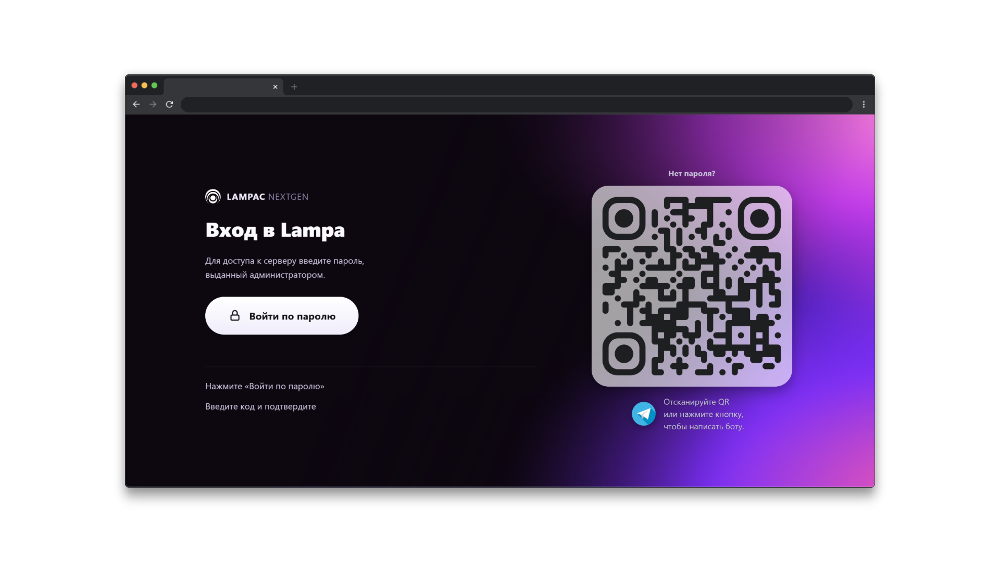

# QRAuth

[](LICENSE)
[](https://github.com/lampac-nextgen/lampac)
[](https://github.com/lampac-nextgen/lampac)
[](https://github.com/TelegramBots/Telegram.Bot)

> Плагин-модуль для [Lampac NextGen](https://github.com/lampac-nextgen/lampac): рисует кастомный экран авторизации с QR-кодом (`plugins/override/deny.js`) и держит Telegram-бота, который подтверждает вход по этому QR и умеет принимать заявки на доступ — пользователь жмёт «Запросить доступ», администратор одобряет/отклоняет кнопкой, при одобрении бот сам создаёт запись в `users.json`. Ничего сверх этого не делает — ни админ-панели, ни рассылок, ни продления/отзыва доступа.

---

## Содержание

- **[Скриншоты](#скриншоты)**
- **[Возможности экрана авторизации](#возможности-экрана-авторизации)**
- **[Требования](#требования)**
- **[Установка](#установка)**
- **[Конфигурация](#конфигурация)**
  - [Секция TelegramBot](#секция-telegrambot)
  - [Секция DenyPage](#секция-denypage)
- **[Заявки на доступ](#заявки-на-доступ)**
- **[QR-вход](#qr-вход)**
- **[Формат users.json](#формат-usersjson)**
- **[Разработка](#разработка)**
  - [Архитектура](#архитектура)
  - [Локальная сборка](#локальная-сборка)
  - [Добавление нового поля конфигурации DenyPage](#добавление-нового-поля-конфигурации-denypage)
- **[Почему так постно](#почему-так-постно)**
- **[Лицензия](#лицензия)**

---

## Скриншоты

<p align="center">
  
</p>

---

## Возможности экрана авторизации

| | |
|---|---|
| **Кастомизация текстов** | Заголовок, подзаголовок, шаги инструкции, подписи QR-блока — всё через `init.conf` |
| **QR-код Telegram** | Генерируется автоматически для бота; скрывается, если `tg_target` не задан |
| **Горячая перезагрузка** | `"dynamic": true` — изменения применяются без перезапуска сервера |
| **Хэш-диффинг** | Файл перезаписывается только при реальных изменениях конфига |
| **Защита от XSS** | Текст из конфига вставляется через `textContent`/`href`, а не в разметку — HTML не интерпретируется |
| **Адаптивная вёрстка** | Размеры завязаны на `em`/масштаб интерфейса самой Lampa — одинаково читаемо на TV, десктопе и мобильном |

---

## Требования

> [!IMPORTANT]
> Модуль ничего не проверяет со стороны Lampac и не подменяет `accsdb` — он только читает/дописывает `users.json` (тот же файл, что accsdb использует для авторизации) и рисует фронтенд (`deny.js`). По Telegram ID он выдаёт разовое подтверждение входа (QR) и по одобренной админом заявке добавляет новую запись. Редактирование и отзыв существующих записей — по-прежнему вручную.

- Работающий сервер **Lampac NextGen**
- Включённый `accsdb` в основном `init.conf` сервера (см. [ниже](#1-включить-accsdb-в-основном-initconf-сервера)) — без него экран авторизации нарисуется, но проверка пароля работать не будет
- Токен Telegram-бота — получить у [@BotFather](https://t.me/BotFather) (`/newbot`)

### 1. Включить `accsdb` в основном `init.conf` сервера

`accsdb` — встроенная функция самого Lampac NextGen (не часть этого плагина). Именно она обслуживает эндпоинт `/testaccsdb`, к которому обращается сгенерированный `deny.js` — проверяет пароль, ведёт лимиты и блокировки.

```json
"accsdb": {
  "enable": true,
  "whitepattern": "^/(adminpanel|tgbot/qr)",
  "shared_passwd": "ваш_пароль",
  "shared_daytime": 3660,
  "maxip_hour": 10,
  "maxrequest_hour": 2000,
  "maxlock_day": 3,
  "blocked_hour": 36,
  "authMesage": "Текст при успешной авторизации",
  "denyMesage": "Текст при отказе в доступе",
  "accounts": {},
  "users": []
}
```

| Поле | Описание |
|---|---|
| `enable` | без `true` эндпоинт `/testaccsdb` не работает — модуль бесполезен |
| `whitepattern` | regex путей, которые пропускаются без проверки пароля — сюда обязательно входит `tgbot/qr` (см. [QR-вход](#qr-вход)) |
| `shared_passwd` | общий пароль на всех, если не используются персональные `accounts`/`users` |
| `shared_daytime` | сколько секунд действует сессия после успешного ввода пароля |
| `maxip_hour` / `maxrequest_hour` | лимиты запросов с одного IP в час |
| `maxlock_day` / `blocked_hour` | блокировка после N неудачных попыток в день, на M часов |
| `accounts` / `users` | персональные пароли/аккаунты — заполняются вручную или через заявку боту |

> [!NOTE]
> Это конфигурация ядра Lampac NextGen, а не этого модуля — полный список ключей и их поведение смотрите в документации самого Lampac NextGen.

> [!WARNING]
> `bot_token` — секрет. Не публикуйте и не коммитьте его. Если токен утёк — немедленно перевыпустите через BotFather (`/token` → Revoke).

---

## Установка

> [!NOTE]
> Lampac NextGen использует **Roslyn** — `.cs`-файлы компилируются сервером на лету. Отдельная сборка DLL для продакшена не нужна, `Telegram.Bot.dll` уже лежит в `references/` этого репозитория.

**1.** Скопируйте содержимое папки `QRAuth/` в `mods/` рядом с исполняемым файлом Lampac:

```
mods/
└── QRAuth/
    ├── manifest.json
    ├── modInit.cs
    ├── DenyPageGenerator.cs
    ├── controllers/
    │   └── qrauthcontroller.cs
    ├── models/
    │   ├── denyPageConf.cs
    │   ├── lampacUser.cs
    │   └── telegramBotConf.cs
    ├── services/
    │   ├── botsession.cs
    │   ├── filelog.cs
    │   ├── qrauthsessions.cs
    │   ├── telegrambothostedservice.cs
    │   └── usersrepository.cs
    └── references/
        └── Telegram.Bot.dll
```

> [!WARNING]
> После добавления/удаления `.cs`-файлов в модуле сделайте **полный рестарт** сервера (не полагайтесь на hot-reload) — регистрация `BackgroundService` через DI надёжно подхватывается только при старте процесса.

**2.** Заполните секции `TelegramBot` и `DenyPage` в `init.conf` (см. [Конфигурация](#конфигурация)) и добавьте `tgbot/qr` в `accsdb.whitepattern`.

**3.** Перезапустите сервер.

<details>
<summary><b>Отключение модуля / отдельных частей</b></summary>

<br>

| Способ | Где | Эффект |
|---|---|---|
| `enable=false` в `init.conf` | секция `TelegramBot` | бот не запускается, экран авторизации при этом продолжает работать (без QR — `tg_target` можно оставить как статичную ссылку) |
| `show_qr=false` в `init.conf` | секция `DenyPage` | экран авторизации не рисует QR-блок, форма пароля остаётся |
| `"enable": false` в `manifest.json` | файл в папке модуля | хост вообще не загружает модуль (и бот, и экран авторизации) — требует перезапуска сервера |

</details>

---

## Конфигурация

### Секция TelegramBot

```json
"TelegramBot": {
  "enable": true,
  "bot_token": "123456:ABC-DEF...",
  "users_file_path": "users.json",
  "log_path": "tgbot.log",
  "admin_ids": [123456789]
}
```

| Поле | Тип | По умолчанию | Описание |
|---|---|---|---|
| `enable` | `bool` | `true` | Выключает бота без удаления файлов (экран авторизации продолжает работать) |
| `bot_token` | `string` | `""` | Токен от [@BotFather](https://t.me/BotFather) |
| `users_file_path` | `string` | `"users.json"` | Путь к файлу пользователей Lampac — **тот же файл**, что использует сам Lampac для авторизации |
| `log_path` | `string` | `"tgbot.log"` | Путь к собственному лог-файлу бота (запуск, ошибки, выдача/отклонение доступа) — не зависит от логирования хоста |
| `admin_ids` | `long[]` | `[]` | Telegram ID администраторов, которым приходят заявки на доступ и которые вправе жать «Выдать»/«Отклонить». Пусто — кнопка запроса доступа отвечает «Администратор не настроен» |

> [!NOTE]
> Если `enable=true`, но `bot_token` пустой — модуль пишет предупреждение в консоль сервера и не поднимает бота, без падения всего процесса.

> [!TIP]
> Узнать свой Telegram ID для `admin_ids` можно у [@userinfobot](https://t.me/userinfobot).

> [!WARNING]
> **Docker:** `users_file_path` и `log_path` — пути **внутри контейнера**, не на хосте. Относительный путь (по умолчанию) резолвится относительно рабочей директории процесса Lampac в контейнере (обычно `/lampac`), а не относительно `docker-compose.yaml`. Если в `init.conf` указать хостовый путь вроде `/opt/lampac/users.json` — такой директории внутри контейнера нет, запись упадёт с ошибкой (в боте это всплывёт алертом «Ошибка записи в users.json»), а бот молча не выдаст доступ. Указывай контейнерный путь, соответствующий тому, что смонтирован в `docker-compose.yaml`, например:
> ```json
> "users_file_path": "/lampac/users.json",
> "log_path": "/lampac/mods/QRAuth/tgbot.log"
> ```
> Том `mods` (`./mods:/lampac/mods`) уже смонтирован в стандартном compose-файле Lampac — писать `log_path` внутрь него достаточно, чтобы лог был виден на хосте без docker exec.

### Секция DenyPage

Параметры экрана авторизации задаются в секции `[DenyPage]` файла `init.conf`. Изменения применяются автоматически — перезапуск сервера не требуется.

```json
"DenyPage": {
  "tg_target": "@YourBot",
  "show_qr": true,
  "page_title": "Вход в систему",
  "page_subtitle": "Для доступа к серверу введите пароль, выданный администратором.",
  "step1_text": "Нажмите «Войти» и введите пароль.",
  "qr_caption": "Нет пароля?",
  "qr_subcaption": "Отсканируй QR или нажми кнопку, чтобы написать боту.",
  "tg_button_text": "Написать боту"
}
```

<details>
<summary><b>Все поля с описанием</b></summary>

<br>

| Поле | Тип | Описание |
|---|---|---|
| `tg_target` | `string` | Управляет QR-блоком. Принимает `@username`, `https://t.me/…` или `tg://` — должен совпадать с ботом из секции `TelegramBot` для рабочего QR-входа |
| `show_qr` | `bool` | QR отображается только если `tg_target` задан **и** `show_qr = true` |
| `page_title` | `string` | Заголовок страницы ✓ |
| `page_subtitle` | `string` | Подзаголовок ✓ |
| `step1_text` | `string` | Текст шага 01 ✓ |
| `step2_text` | `string` | Текст шага 02 ✓ |
| `qr_caption` | `string` | Заголовок QR-блока ✓ |
| `qr_subcaption` | `string` | Подпись QR-блока ✓ |
| `tg_button_text` | `string` | Текст кнопки Telegram (`aria-label` иконки) ✓ |
| `page_badge` | `string` | Заголовок-бейдж над формой — в модели, `Build()` не читает |

### Форматы `tg_target`

> [!TIP]
> Все варианты нормализуются автоматически — достаточно указать `@username`.

```
@mybotname          →  https://t.me/mybotname
mybotname           →  https://t.me/mybotname
https://t.me/bot    →  https://t.me/bot         (без изменений)
tg://resolve?...    →  tg://resolve?...          (без изменений)
```

</details>

---

## Заявки на доступ

```
Пользователь: /start → нет активного доступа → кнопка «🔑 Запросить доступ»
        │
        ▼
Бот шлёт каждому admin_ids сообщение с заявкой и кнопками «✅ Выдать» / «❌ Отклонить»
        │
        ├── Отклонить → пользователю уходит «❌ Отклонено», запись не создаётся
        │
        └── Выдать → UsersRepository.AddUser() дописывает users.json:
                      новый токен (id), tg_id, expires = далёкое будущее (см. ниже)
                      │
                      ▼
              Пользователю приходит пароль (id) в личку от бота
```

Ограничения:
- Повторная заявка от того же пользователя игнорируется 10 минут (защита от спама кнопкой), сессии этого таймера — в памяти процесса, обнуляются рестартом бота.
- Кнопки «Выдать»/«Отклонить» проверяют, что нажавший есть в `admin_ids` — нажатие не-админом отвечает «Недоступно» и ничего не меняет.
- Если у пользователя уже есть доступ (не забанен), повторная заявка не отправляется — бот сразу отвечает, что доступ уже есть.
- `AddUser` заменяет **весь** прежний доступ этого `tg_id` новой записью (старый токен перестаёт быть валидным) — так же ведёт себя ручное редактирование `users.json`.
- Доступ не имеет срока — модуль не выставляет `expires` осмысленно (пишет фиксированную дату на 100 лет вперёд) и не умеет его продлевать/сокращать. Единственный рычаг управления доступом — бан/разбан через `/users` в боте.

---

## QR-вход

Экран авторизации (`deny.js`) и бот работают вместе через два публичных HTTP-эндпоинта, которые модуль сам регистрирует (`controllers/qrauthcontroller.cs`):

```
deny.js:        GET /tgbot/qr/start  → { session }
                строит QR на https://t.me/<bot>?start=qr_<session>
        │
        ▼
Пользователь сканирует QR → /start qr_<session> в боте
        │
        ├── нет активного доступа в users.json → «Обратитесь к администратору»
        │
        └── доступ активен → бот показывает «✅ Подтвердить вход»
                    │
                    ▼
            Нажатие → callback qrauth:<session> → QrAuthSessions.TryConfirm(session, user.Id)
                    │
                    ▼
deny.js:        поллинг GET /tgbot/qr/status?session=... → { status: confirmed, token }
                → сам логинится этим токеном через `{localhost}/testaccsdb`
```

Сессии живут **3 минуты**, хранятся в памяти процесса (`services/qrauthsessions.cs`), одноразовые — статус `confirmed` отдаётся ровно один раз, повторный опрос той же сессии вернёт `expired`. Перезапуск бота обнуляет все активные сессии (пользователь просто пересканирует QR).

Работает только для входа **в существующий, уже активный** аккаунт — бот не создаёт и не одобряет доступ, только подтверждает, что человек с этим Telegram-аккаунтом действительно тот, за кого себя выдаёт. Пока сессия не создана (или бот отключён/недоступен), QR ведёт на статичный `tg_target` — это тот же URL, что и без QR-входа.

> [!IMPORTANT]
> Эндпоинты `/tgbot/qr/start` и `/tgbot/qr/status` должны быть доступны неавторизованному посетителю: добавьте `tgbot/qr` в `accsdb.whitepattern` на сервере Lampac (см. [Требования](#требования)), иначе accsdb будет их блокировать раньше, чем запрос дойдёт до контроллера.

### Команды бота

Единственная — `/start`. Без параметров: короткое приветственное сообщение. С `qr_<session>` (то есть по QR-ссылке): проверка доступа + кнопка подтверждения.

### Логика формы пароля (без QR)

Кнопка «Войти» открывает `Lampa.Input.edit(...)` — встроенную текстовую клавиатуру Lampa (та же, что использует стоковый `deny.js`), а не самодельный HTML `<input>`. Она уже умеет работать на Apple TV/tvOS и других TV-платформах без ручных фокус-хаков.

```
POST {localhost}/testaccsdb?account_email=<пароль>&uid=<uid>
```

| Результат | Поведение |
|---|---|
| `success = true`, `uid` задан | Аккаунт создан — показывает UID один раз, ждёт явного «Понятно, продолжить» перед редиректом |
| `success = true`, `uid` не задан | Сохраняет пароль как `lampac_unic_id`, редирект на `/` |
| `success = false` | Показывает «Неправильный пароль» |
| Ошибка сети | Показывает «Ошибка соединения» |

---

## Формат users.json

Файл правится **вручную** (или другими инструментами — этот модуль его только читает и добавляет через заявки). Пример записи:

```json
{
  "id": "987654321",
  "tg_id": 123456789,
  "group": 1,
  "expires": "2027-01-01T00:00:00+03:00",
  "comment": "@ivanov / Иван",
  "params": { "adult": false, "admin": false }
}
```

Для QR-входа важны только `tg_id` (числовой Telegram ID пользователя — не username, не 0) и `ban` (доступ считается активным, пока `ban = false`; модуль сам `expires` не читает и не проверяет — это поле нужно только Lampac core). Значение `id` — это то, чем в итоге логинится экран авторизации (тот же токен, что можно ввести вручную в форму пароля).

> [!TIP]
> Свой Telegram ID узнать можно у [@userinfobot](https://t.me/userinfobot).

---

## Разработка

<details>
<summary><b>Архитектура</b></summary>

<br>

```
QRAuth/
├── manifest.json                     # Метаданные модуля для Lampac (enable/dynamic/references)
├── modInit.cs                        # IModuleLoaded/IModuleConfigure — единая точка входа модуля:
│                                      #   синк конфига бота + генерация/таймер deny.js
├── DenyPageGenerator.cs              # Генератор deny.js (чистый static builder)
├── controllers/
│   └── qrauthcontroller.cs           # HTTP: GET /tgbot/qr/start, /tgbot/qr/status
├── models/
│   ├── denyPageConf.cs               # Конфигурация экрана авторизации (секция DenyPage)
│   ├── lampacUser.cs                 # Read-only модель users.json
│   └── telegramBotConf.cs            # Конфигурация бота (секция TelegramBot)
└── services/
    ├── telegrambothostedservice.cs   # BackgroundService: long polling (GetUpdates)
    ├── botsession.cs                 # /start и qrauth: callback — больше ничего
    ├── qrauthsessions.cs             # Короткоживущие одноразовые сессии подтверждения
    ├── usersrepository.cs            # Read-only чтение users.json (ReadAll/GetByTgId)
    └── filelog.cs                    # Свой append-only лог модуля (см. log_path)
```

`modInit.cs` — единственный класс `ModInit`, который видит загрузчик модулей Lampac (по конвенции — один `ModInit` на папку модуля): бот и экран авторизации физически один C#-модуль, поэтому обе части инициализируются из одного `Loaded()`/`Dispose()`, но настраиваются и выключаются независимо через `init.conf` (см. [Отключение модуля / отдельных частей](#установка)).

**`telegrambothostedservice.cs`** — снимает вебхук, крутит **long polling** (`GetUpdates`) в простом цикле.

**`botsession.cs`** — без ролей/меню в классическом смысле, роль админа — это просто проверка `tg_id` против `admin_ids` из конфига на конкретных двух колбэках. Маршруты: `/start [qr_<id>]`, callback `qrauth:<id>` (QR-вход), `reqaccess` (запрос доступа), `grant:<tg_id>` / `deny:<tg_id>` (решение админа). Кулдаун повторных заявок — `ConcurrentDictionary<long,DateTime>` в памяти процесса, не файл.

**`usersrepository.cs`** — чтение (`ReadAll`, `GetByTgId`) плюс `AddUser(tgId, comment)`, которым закрывается заявка на доступ (пишет фиксированный далёкий `expires`, никакого выбора срока), и `RevokeByToken`/`UnbanByToken` для бана/разбана — генерирует токен, заменяет прежнюю запись этого `tg_id` и перезаписывает `users.json` целиком под `lock`. Никакого `Mutate` произвольных полей — это единственные пути записи.

**`DenyPageGenerator.cs`** — статический построитель: `Build(DenyPageConf)` возвращает полное содержимое `deny.js`; QR-колонка генерируется только если `tg_target` задан и `show_qr = true`.

</details>

<details>
<summary><b>Локальная сборка</b></summary>

<br>

Прилагаемый `QRAuth.csproj` — для IDE/линтинга/CI, не для продакшена (сам Lampac его не использует, см. [Установка](#установка)):

```
dotnet build QRAuth.csproj
```

Требует .NET 10 SDK. Тянет пакет `Telegram.Bot` и копирует DLL в `references/` автоматически после сборки.

</details>

<details>
<summary><b>Добавление нового поля конфигурации DenyPage</b></summary>

<br>

1. Добавьте свойство в `models/denyPageConf.cs` с дефолтным значением
2. Используйте значение в `DenyPageGenerator.Build()` — включите в генерируемый HTML/JS
3. Обновите таблицу полей в этом README

</details>

---

## Почему так постно

Изначально бот умел куда больше: самообслуживание заявок на доступ, одобрение/отклонение админом, выдачу и продление токенов, блокировки, рассылки, аудит-лог, ежедневные уведомления об истечении. Почти всё это было вырезано и стабилизировано заново поверх минимального ядра (QR-вход); из вырезанного обратно вернули только заявку на доступ и одобрение админом (см. [Заявки на доступ](#заявки-на-доступ)) — самое востребованное. Продление/отзыв доступа, блокировки, рассылки, аудит-лог — по-прежнему нет, добавлять по мере необходимости, а не все сразу.

---

## Лицензия

[MIT](LICENSE)
