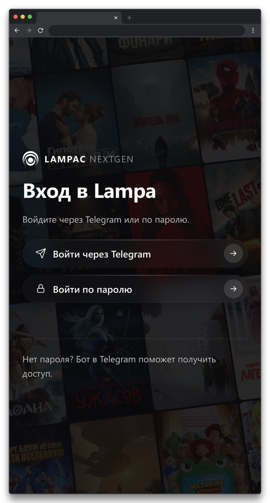

# QRAuth

[](LICENSE)
[](https://github.com/lampac-nextgen/lampac)
[](https://github.com/lampac-nextgen/lampac)
[](https://github.com/TelegramBots/Telegram.Bot)

Плагин для **Lampac NextGen**: экран входа с QR-кодом + Telegram-бот, который выдаёт доступ и подтверждает вход по QR.

<p align="center">
  
  <br>
  <sub>ТВ и браузер: QR-код для входа с телефона, рядом вход по паролю или через Telegram</sub>
</p>

Как это работает: пользователь сканирует QR → жмёт "Запросить доступ" → админ одобряет кнопкой → бот дописывает `users.json` и сразу логинит именно ту сессию - без ввода пароля. Один аккаунт держит сразу несколько устройств (TV, телефон, браузер).

<p align="center">
  
  <br>
  <sub>Телефон: QR сканировать нечем, поэтому вместо него - кнопка «Войти через Telegram»</sub>
</p>

<details>
<summary>Подробнее про QR-вход и мульти-устройства</summary>

<br>

- **Один аккаунт - много устройств.** Токен не привязан к устройству: один пароль/токен можно ввести на TV, телефоне и в браузере одновременно. Ограничений по количеству нет (только `accsdb.maxip_hour`/`maxrequest_hour`, если заданы, - это лимит частоты запросов, не число устройств).
- **QR удобнее пароля на TV** - не нужна экранная клавиатура, только сканирование и одна кнопка "Подтвердить" в Telegram.
- **QR одноразовый и живёт 3 минуты.** Своя сессия на каждую загрузку страницы - два устройства/пользователя друг другу не мешают. По истечении 3 минут страница сама запрашивает новый QR, без перезагрузки.
- Пароль тоже выдаётся при одобрении (для входа на другом устройстве вручную), но сам запрос через QR его не требует.

</details>

Админ управляет доступом через `/users` в боте - список, бан/разбан, статистика.

---

## Быстрый старт

**1. Скопируйте папку `QRAuth/` в `mods/` рядом с исполняемым файлом Lampac.**

Roslyn компилирует `.cs` на лету - собирать ничего не нужно, `Telegram.Bot.dll` уже лежит в `references/`.

**2. Включите `accsdb` в основном `init.conf` сервера Lampac** (это функция самого Lampac, не этого модуля):

```json
"accsdb": {
  "enable": true,
  "whitepattern": "^/(adminpanel|tgbot/qr)",
  "shared_passwd": "ваш_пароль",
  "accounts": {},
  "users": []
}
```

`tgbot/qr` в `whitepattern` больше не обязателен: модуль сам пропускает свои адреса `/tgbot/qr/*` (QR-вход и постеры) через обработчик `EventListener.Accsdb`. Если он уже прописан, ничего не меняйте.

**3. Добавьте в `init.conf` секции модуля:**

```json
"TelegramBot": {
  "enable": true,
  "bot_token": "123456:ABC-DEF...",
  "admin_ids": [123456789]
},
"DenyPage": {
  "tg_target": "@YourBot",
  "show_qr": true,
  "page_title": "Вход в систему",
  "page_subtitle": "Для доступа к серверу введите пароль, выданный администратором."
}
```

Токен бота - у [@BotFather](https://t.me/BotFather) (`/newbot`). Свой Telegram ID для `admin_ids` - у [@userinfobot](https://t.me/userinfobot).

**4. Перезапустите сервер.** Дальше правки `DenyPage` подхватываются на лету, но при первой установке (или после добавления/удаления `.cs`-файлов) нужен полный рестарт процесса.

---

## Что умеет бот

- **`/start`** → кнопка "🔑 Запросить доступ" для нового пользователя.
- Заявка уходит всем `admin_ids` с кнопками "✅ Выдать" / "❌ Отклонить". Одобрение сразу дописывает `users.json` и присылает пользователю пароль.
- **`/users`** (только для админов) - список пользователей, карточка каждого, бан/разбан, статистика (всего / активных / заблокированных).
- **QR-вход**: тот, у кого уже есть доступ, сканирует QR на экране входа и подтверждает вход одной кнопкой в боте - не нужно вводить пароль руками.
- Доступ не имеет срока действия - только бан/разбан. Продления, рассылок и аудит-лога нет: сделано минимально, разрастим по необходимости.

<details>
<summary>Протокол заявки на доступ</summary>

<br>

```
Пользователь: /start → нет доступа → "🔑 Запросить доступ"
        │
        ▼
Бот шлёт каждому admin_ids карточку с кнопками "✅ Выдать" / "❌ Отклонить"
        │
        ├── Отклонить → пользователю "❌ Отклонено", запись не создаётся
        │
        └── Выдать → UsersRepository.AddUser() дописывает users.json
                      (новый токен, старый доступ этого tg_id - если был - заменяется)
                      │
                      ▼
              Пользователю приходит пароль в личку
```

- Повторная заявка от того же пользователя игнорируется 10 минут (защита от спама кнопкой) - таймер в памяти процесса, обнуляется рестартом бота.
- Кнопки "Выдать"/"Отклонить" проверяют `admin_ids` - нажатие не-админом ничего не меняет.
- Если у пользователя уже есть активный (не забаненный) доступ, повторная заявка не уходит - бот сразу отвечает, что доступ уже есть.
- Доступ не имеет срока - `expires` пишется фиксированной далёкой датой и не читается модулем. Единственный рычаг - бан/разбан через `/users`.

</details>

<details>
<summary>QR-хендшейк</summary>

<br>

```
deny.js:  GET /tgbot/qr/start  → { session }
          строит QR на https://t.me/<bot>?start=qr_<session>
        │
        ▼
Пользователь сканирует QR → /start qr_<session> в боте
        │
        ├── нет доступа → "Запросить доступ" (тот же путь, что и заявка)
        │
        └── доступ активен → бот показывает "✅ Подтвердить вход"
                    │
                    ▼
            Нажатие → callback qrauth:<session> → QrAuthSessions.TryConfirm(session, token)
                    │
                    ▼
deny.js:  поллинг GET /tgbot/qr/status?session=... → { status: confirmed, token }
          → логинится этим токеном через {localhost}/testaccsdb
```

- Сессия живёт **3 минуты**, хранится в памяти процесса, одноразовая - `confirmed` отдаётся ровно один раз, повторный опрос вернёт `expired`. По истечении страница сама запрашивает новую сессию.
- Если пользователь сканирует QR без доступа и подаёт заявку - одобрение админом сразу же логинит именно ту сессию, без ввода пароля (см. "Что умеет бот").
- Рестарт бота обнуляет все активные сессии - пользователь просто пересканирует QR.
- Эндпоинты `/tgbot/qr/*` должны быть доступны неавторизованному посетителю - модуль пропускает их сам (`ModInit.AllowQrRoutes`), правка `accsdb.whitepattern` не нужна.

</details>

<details>
<summary>Формат users.json</summary>

<br>

Файл правится **вручную** (или ботом через заявки/бан) - модуль его только читает и точечно дописывает. Пример записи:

```json
{
  "id": "987654321",
  "tg_id": 123456789,
  "group": 1,
  "expires": "2126-01-01T00:00:00Z",
  "comment": "@ivanov / Иван",
  "ban": false
}
```

Для работы модуля важны только `id` (токен - то, чем логинится экран входа), `tg_id` (число, не username - по нему бот ищет запись) и `ban` (доступ активен, пока `ban = false`). `expires` модуль сам не проверяет - это поле только для ядра Lampac.

</details>

<details>
<summary>Как это стыкуется с accsdb и ядром Lampac</summary>

<br>

Модуль и ядро Lampac - два независимых процесса кода, которые не вызывают друг друга напрямую. Вся интеграция - это один общий файл `users.json` и один HTTP-эндпоинт, который принадлежит самому ядру, а не модулю:

- **Откуда берётся `id`.** Когда админ жмёт "Выдать", `UsersRepository.AddUser()` генерирует токен сам - 9 случайных байт (`RandomNumberGenerator`) в base64url, без паддинга (~12 символов). Это и есть `id` в `users.json`, он же пароль, который бот присылает пользователю, он же значение, которым логинится `deny.js` (`uid=`/`account_email=` в запросе на `/testaccsdb`).
- **Кто отвечает на `/testaccsdb`.** Это код ядра Lampac (`ApiController.TestAccsdb`, не этого модуля). `deny.js` шлёт туда `account_email`/`uid`, ядро сверяет их со своим in-memory списком аккаунтов и возвращает `accsdb`/`success`/`uid`. Модуль в этот обмен не вмешивается - только заранее кладёт запись в `users.json`, чтобы ядру было с чем сверять.
- **Как ядро узнаёт про новую запись.** Ядро не читает `users.json` на каждый запрос - у него свой поллер (`Program.cs: UpdateUsersDb`, раз в ~1 секунду), который проверяет `mtime` файла и домердживает новые/изменённые записи в свой in-memory кэш (`accsdb.users`). Поэтому между "админ нажал Выдать" и "пользователь реально может залогиниться" есть задержка до секунды - это нормально, рестарт не нужен.
- **Почему бан - это `ban=true`, а не удаление строки.** Поллер ядра только домердживает (upsert), но никогда не вычищает из кэша запись, чья строка исчезла из файла - удалённый пользователь так и останется залогинен до рестарта процесса. Поэтому `RevokeByToken`/`UnbanByToken` правят `ban` на существующей строке - это мутирует тот же закэшированный объект, и `Accsdb` middleware ядра реально обрывает доступ на следующем же запросе.
- **QR-вход не отдельный канал.** Токен, которым подтверждается QR (`QrAuthSessions.TryConfirm`), - тот же `id` из `users.json`. Подтверждение в боте просто передаёт `deny.js` этот токен, а дальше это тот же путь через `/testaccsdb`, что и ручной ввод пароля.

Итого: если в основном `init.conf` включена `accsdb`, а `whitepattern` пропускает `tgbot/qr`, - для ядра Lampac все записи, созданные ботом, ничем не отличаются от вручную добавленных в `init.conf`/`users.json`.

</details>

---

## Фон из постеров

За экраном входа - стена из постеров популярных фильмов, наклонённая как в Netflix. Её готовит сервис `PosterWall` (`services/posterwall.cs`) прямо на сервере, чтобы телевизору оставалось только показать одну готовую картинку.

**Раз в сутки сервис:**

1. **Берёт список фильмов** из TMDB (`trending`, `popular`, `now_playing` или `top_rated` - см. `poster_source`), до 30 постеров без взрослого контента. Сначала через встроенный в Lampac `/tmdb`-прокси, а если сервер не достаёт до TMDB (РФ/РБ без прокси) - через те же зеркала, что и сама Lampa с «Проксировать TMDB».
2. **Скачивает постеры** в `cache/qrauth/posters/` - во временную папку, которая потом подменяет старую целиком, так что страница никогда не видит наполовину скачанный набор.
3. **Собирает из них стену** с помощью NetVips (библиотека обработки изображений, которая уже есть в Lampac - ставить ничего не нужно): сетка 12×6 со скруглёнными углами, поворот на −7°, затемнение. Получается несколько файлов:

| Файл | Размер | Зачем |
|---|---|---|
| `wall-v2-4k.jpg` | 3840×2160, ~600 KB | Для 2K/4K мониторов и 4K-телевизоров |
| `wall-v2.jpg` | 1920×1080, ~200 KB | Для всех остальных экранов, включая обычные ТВ |
| `wall-v2-lqip.jpg` | 64×36, ~1 KB | Крошечное превью - встраивается прямо в страницу, чтобы цвета стены были видны с первого кадра |
| `wall-v2-glass.jpg` | 320×180, ~7 KB | Размытая копия для «стеклянных» кнопок (см. ниже) |

Сборка занимает несколько секунд в фоне и повторяется только когда обновился набор постеров.

**Как это показывает страница:**

- **ТВ и компьютер** грузят одну картинку по `/tgbot/qr/wall` (с `?s=4k` - если экран шире ~2000 физических пикселей). Адрес и превью уже вшиты в `deny.js`, поэтому загрузка начинается сразу, без лишних запросов: сначала мгновенно видно размытое превью, поверх догружается чёткая стена.
- **Стеклянные кнопки** на ТВ и компьютере - тоже заготовка: вместо размытия на лету (`backdrop-filter`, который в WebView Android TV не размывал вообще и сильно грузил слабые ТВ) кнопка показывает заранее размытый кусок стены ровно под собой. На глаз не отличить, а телевизору почти нечего считать.
- **Телефоны** собирают стену из отдельных постеров (`/tgbot/qr/poster/{n}`) - растягивать широкую картинку на вертикальный экран было бы мыльно.

<details>
<summary>Технические детали</summary>

<br>

- **Только свои адреса наружу.** Неавторизованный посетитель не может ходить в `/tmdb/*` Lampac (его блокирует `accsdb`), поэтому модуль скачивает постеры сам - локальным запросом с `lcrqpasswd`, как модуль Catalog, - и открывает наружу только `/tgbot/qr/posters`, `/tgbot/qr/poster/{n}` и `/tgbot/qr/wall`. Пускает их обработчик `EventListener.Accsdb` модуля, `whitepattern` не нужен.
- **Без расширения в адресах** (`/poster/3`, а не `/poster/3.jpg`): `accsdb` отдаёт 404 на `*.jpg` для неавторизованных ещё до того, как модуль успеет их пропустить.
- **Кэш.** Картинки отдаются с `Cache-Control: max-age=86400`, а в адресе есть `?v=<версия набора>` - повторное открытие берёт всё из кэша, новый набор получает новый адрес.
- **Проверка каждые 10 минут** (первая - через 15 секунд после старта) ничего не делает, пока набору меньше суток; она нужна, чтобы быстро повторить попытку после сбоя. После перезапуска модуль сразу подхватывает уже скачанный набор с диска.
- **Если NetVips недоступен** (`imagelibrary` в `init.conf` не `NetVips` или нет нативной библиотеки под платформу), готовая стена не собирается, и ТВ с компьютером тоже собирают её из отдельных постеров - ничего не ломается. Если нет и постеров (TMDB недоступен), остаётся просто тёмный фон.
- **Состояние** видно в ответе `/tgbot/qr/posters`: `{"count":30,"v":…,"wall":true,"state":"ok"}`. Подробности сбоев пишутся в `tgbot.log`.

</details>

---

## Конфигурация - все поля

<details>
<summary><b>TelegramBot</b></summary>

<br>

| Поле | Тип | По умолчанию | Описание |
|---|---|---|---|
| `enable` | `bool` | `true` | Выключить бота без удаления файлов (экран входа продолжит работать) |
| `bot_token` | `string` | `""` | Токен от BotFather. Пусто + `enable=true` → предупреждение в консоли, бот не поднимается, сервер не падает |
| `users_file_path` | `string` | `"users.json"` | Файл пользователей - тот же, что читает `accsdb` |
| `log_path` | `string` | `"tgbot.log"` | Собственный лог модуля |
| `admin_ids` | `long[]` | `[]` | Кто получает заявки и видит `/users`. Пусто → кнопка запроса доступа отвечает "Администратор не настроен" |

> [!WARNING]
> **Docker:** `users_file_path` и `log_path` - пути **внутри контейнера** (обычно `/lampac/...`), не на хосте.

</details>

<details>
<summary><b>DenyPage</b></summary>

<br>

| Поле | Тип | Описание |
|---|---|---|
| `tg_target` | `string` | `@username`, `https://t.me/…` или `tg://` - управляет QR-блоком, должен совпадать с ботом из `TelegramBot` |
| `show_qr` | `bool` | QR виден только если `tg_target` задан **и** `show_qr = true` |
| `page_title`, `page_subtitle` | `string` | Заголовок и подзаголовок |
| `step1_text`, `step2_text` | `string` | Строки подсказки под кнопками. Пустая строка не выводится; по умолчанию только `step2` (если задан `tg_target`) |
| `qr_subcaption` | `string` | Подпись под QR |
| `tg_button_text` | `string` | Текст кнопки «Войти через Telegram»: на телефоне она заменяет QR, в браузере на компьютере стоит под кнопкой пароля. На ТВ кнопки нет - там только QR |
| `poster_wall` | `bool` | Фон из постеров фильмов в стиле Netflix (по умолчанию `true`). Постеры модуль сам берёт раз в сутки через встроенный в Lampac `/tmdb`-прокси, а если сервер не достаёт до TMDB (РФ/РБ без прокси) - через те же зеркала, что и Lampa с «Проксировать TMDB» (`apitmdb.cub.red`, `imagetmdb.com` и др.), кэширует в `cache/qrauth/posters/` и собирает из них готовую картинку - подробнее в разделе [Фон из постеров](#фон-из-постеров). Если постеров нет, остаётся обычный тёмный фон |
| `poster_source` | `string` | Откуда постеры: `trending` (по умолчанию, тренды недели), `popular`, `now_playing`, `top_rated` |

</details>

---

## Отключение

| Способ | Эффект |
|---|---|
| `TelegramBot.enable=false` | бот не запускается, экран входа работает без QR |
| `DenyPage.show_qr=false` | экран входа без QR-блока, форма пароля остаётся |
| `DenyPage.poster_wall=false` | без фона из постеров, модуль не ходит в TMDB |
| `"enable": false` в `manifest.json` | модуль вообще не грузится (нужен рестарт сервера) |

---

## Разработка

Локальная сборка для IDE/линтинга (сам Lampac её не использует):

```
dotnet build QRAuth.csproj
```

Требует .NET 10 SDK.

---

## Лицензия

[MIT](LICENSE)
